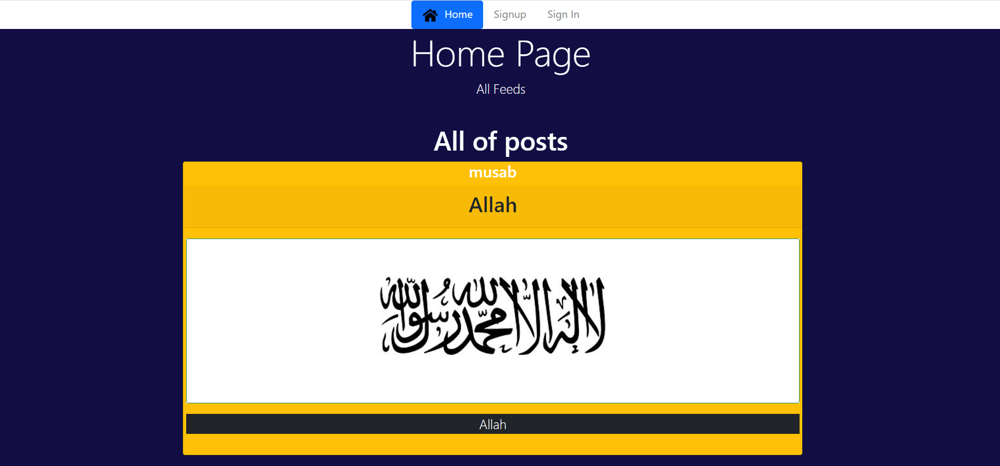
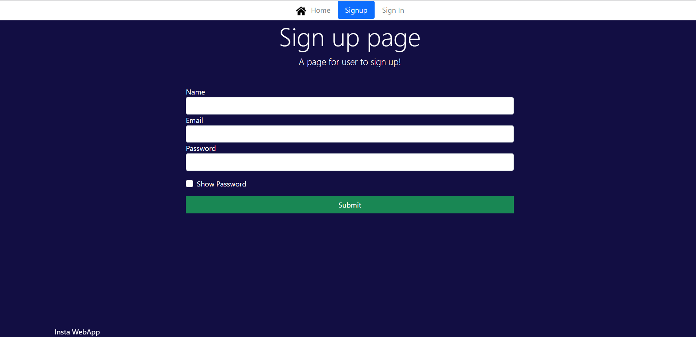
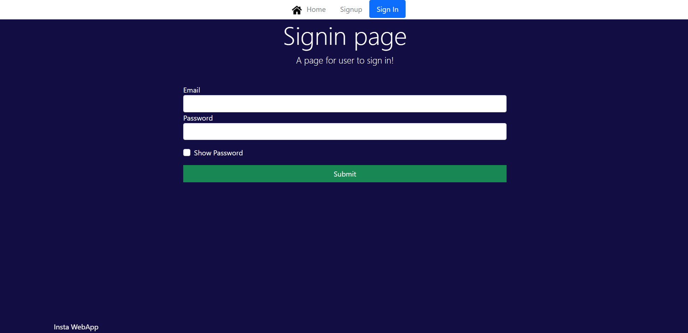
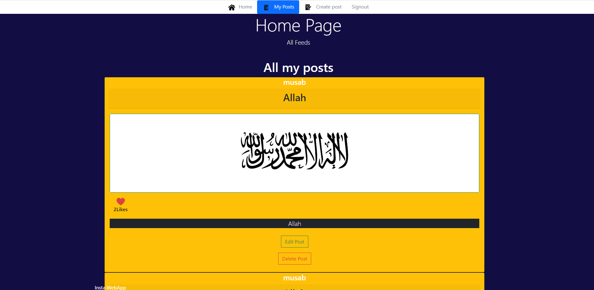
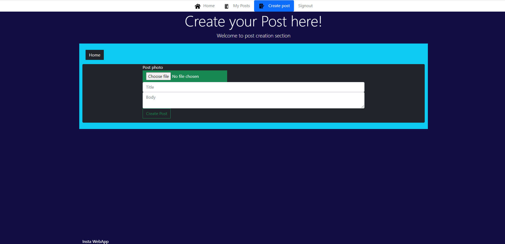
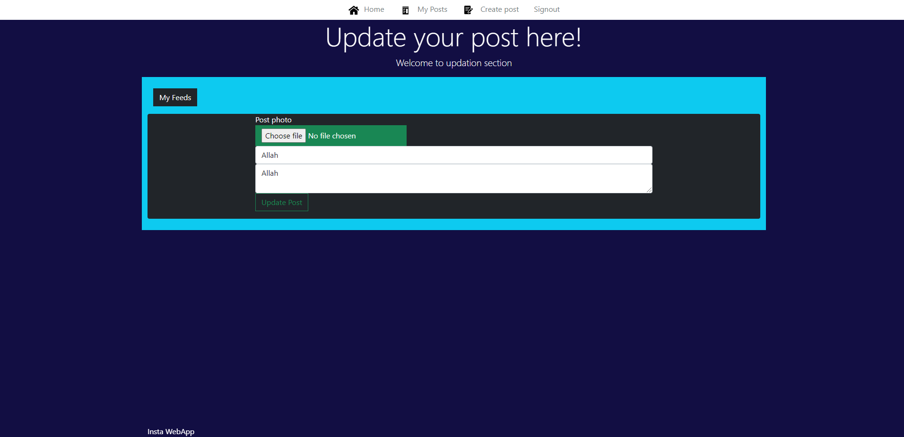
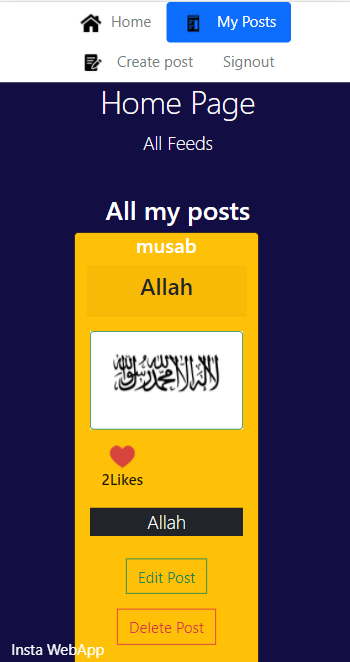

# mininsta

A Webapp for people to post content they like. Similar to instagram, this app provides features like:
1. Upload photos - add a title and description.
2. Give a Like to an existing post.

This project is build using MERN Stack (MongoDB,Express,React,Nodejs) 

This project has : 
1. User 
2. Stranger 

Each of them have different roles to play

1. User: 
This is the person who will have access to the website from the frontend and will have all the functionalities like : 
a) Creating a user account by signing up  
b) Create a custom post  
c) Add title, description and photo to his/her post 
d) Edit an existing post which was created by him  
e) Delete a post from his feeds 
f) Like functionality for a post 
g) View all posts created by different users (LIKE A POST TOO ;) ) 

2. Stranger 
He is a person who can visit the Webapp and view posts created by different users. He can freely view content here and can create an account for himself too. 

### Home page where users can see existing posts

### Sign up page for new users

### Signin page for existing users

### User Dashboard (My Posts) 

### Create a new post (Add new posts here)

### Update your existing post 

### Mobile responsive

